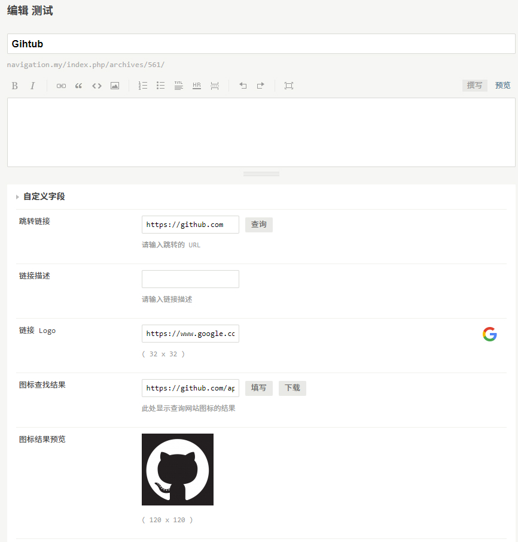

# 获取网站图标+

 

> Chromium extension, Firefox Add-on

这是 [LightAPIs/get-site-favicon](https://github.com/LightAPIs/get-site-favicon) 针对 [LightAPIs/WebStackTypechoTheme](https://github.com/LightAPIs/WebStackTypechoTheme) 主题特制的浏览器插件，实现在编辑页面中查询跳转链接网站图标的功能。

## 预览

## 依赖

- [akanshgulati/scrap-favicon](https://github.com/akanshgulati/scrap-favicon) ([MIT license](https://github.com/akanshgulati/scrap-favicon/blob/master/LICENSE))
- [zenorocha/clipboard.js](https://github.com/zenorocha/clipboard.js) ([MIT license](https://github.com/zenorocha/clipboard.js/blob/master/LICENSE))

## License

[GPL-3.0](./LICENSE) license
